# Class Diagram: Agentic Movie Workflow

**Proyecto:** `legatus-video-factory`  
**Fecha:** 2026-03-26  
**Objetivo:** definir un workflow nuevo, agentic y durable para produccion de peliculas, descartando el prototipo lineal como base de arquitectura y reutilizando solo las piezas del repo que siguen siendo validas.

## Decision de arquitectura

La decision correcta no es extender el pipeline actual `Wikipedia -> Story -> Images -> TTS -> FFmpeg`.

La decision correcta es construir un workflow nuevo con estas propiedades:

- `job orchestration` externo sobre FastAPI + Celery + Redis
- `runtime agentic` interno sobre CrewAI Flows + crews/agentes especializados
- `truth layer` durable sobre Postgres + MinIO
- `semantic memory` compartida por job para continuidad, contexto y recall
- `video synthesis` desacoplada via `VideoProvider`

En este diseño:

- una `escena narrativa` no es un clip
- un `shot` de 8 segundos es la unidad de sintesis visual
- la memoria no es la unica fuente de verdad
- el estado estructurado del Flow y los artefactos persistidos mandan

## Reutilizacion del codigo existente

### Reusar casi directo

- `Settings`
- `StorageService`
- `FFmpegRenderer`
- `VideoProvider`
- `GoogleVeoProvider`
- `TTSProviderFactory`
- `BaseTTSProvider`

### Reusar como adapter o wrapper

- `OrchestratorService`
- `BedrockNarrationGenerator`
- `ScriptApprovalService`
- `ImageApprovalService`

### Dejar como compatibilidad, no como dominio principal

- `DocumentaryScript`
- `Scene`
- `VideoRenderRequest`
- `PipelineConfig`
- `PipelineProgress`

### Descartar como base del workflow nuevo

- `src/blackforge/orchestration/langgraph_pipeline.py`
- `src/blackforge/pipeline/orchestrator.py`
- la suposicion de que todo el pipeline vive en un solo worker lineal
- la suposicion de que una escena equivale a una sola unidad renderizable

## Principios de diseño

- `Flow first`: cada job corre como un `MovieProductionFlow` reanudable.
- `Memory scoped`: la memoria se segmenta por job, libro, capitulo, escena y shot.
- `Agents with roles`: cada agente tiene una responsabilidad estrecha y auditable.
- `Structured truth`: outlines, biblias, scenes, shots y aprobaciones viven en datos estructurados.
- `Provider isolation`: Veo, Hunyuan u otro backend solo sintetizan video.
- `Human checkpoints`: aprobaciones humanas siguen siendo parte del sistema, no un parche externo.

## Diagrama de clases

```mermaid
classDiagram

namespace Existing {
  class Settings {
    +aws_region
    +minio_host
    +redis_host
    +bedrock_llm_model_id
    +tts_provider
  }

  class OrchestratorService {
    +create_job()
    +get_job()
    +list_jobs()
  }

  class StorageService {
    +list_assets()
    +get_asset()
    +get_final_video()
  }

  class FFmpegRenderer {
    +render_video()
  }

  class VideoProvider {
    <<interface>>
    +generate_clip()
  }

  class GoogleVeoProvider {
    +generate_clip()
  }

  class BaseTTSProvider {
    <<interface>>
    +synthesize()
    +synthesize_batch()
  }

  class TTSProviderFactory {
    +create()
    +get_available_providers()
  }

  class BedrockNarrationGenerator {
    +generate_narration()
    +generate_image_prompt()
  }

  class ScriptApprovalService {
    +create()
    +approve()
    +reject()
  }

  class ImageApprovalService {
    +create()
    +approve()
    +reject()
    +replace()
  }
}

namespace Agentic {
  class BookSourceProvider {
    <<interface>>
    +fetch_source()
  }

  class ProjectGutenbergProvider {
    +fetch_source()
  }

  class UploadedTextProvider {
    +fetch_source()
  }

  class UploadedEpubProvider {
    +fetch_source()
  }

  class MovieProductionFlow {
    +kickoff()
    +resume()
    +pause_for_approval()
    +finalize()
  }

  class MovieState {
    +job_id
    +documentary_id
    +source_ref
    +chapter_summaries
    +character_bible
    +location_bible
    +scene_plans
    +shot_plans
    +provider_operations
    +approvals
    +final_timeline
  }

  class FlowPersistenceAdapter {
    +load_state()
    +save_state()
    +checkpoint()
  }

  class CrewMemoryHub {
    +remember()
    +recall()
    +scope_for_job()
    +scope_for_scene()
    +scope_for_shot()
  }

  class CrewFactory {
    +build_source_crew()
    +build_planning_crew()
    +build_production_crew()
    +build_qc_crew()
  }

  class ClaudeDirectorGateway {
    +summarize_chapter()
    +build_character_bible()
    +build_location_bible()
    +plan_scene()
    +plan_coverage()
    +direct_veo_prompt()
    +critique_prompt()
  }

  class BookIngestionService {
    +ingest()
    +normalize()
    +split_chapters()
  }

  class AdaptationPlanner {
    +summarize_chapters()
    +extract_beats()
    +allocate_runtime()
    +build_scene_plans()
  }

  class CoveragePlanner {
    +build_shot_plans()
    +assign_transitions()
    +enforce_continuity()
  }

  class PromptDirector {
    +build_video_prompt()
    +build_negative_prompt()
    +build_continuity_prompt()
  }

  class ProviderRouter {
    +select_provider()
    +dispatch_shot()
    +extend_shot()
  }

  class HunyuanVideoProvider {
    +generate_clip()
  }

  class NarrationService {
    +synthesize_scene_narration()
    +synthesize_batch()
  }

  class RenderAssembler {
    +stitch_shots()
    +mix_audio()
    +render_movie()
  }

  class ApprovalGateway {
    +request_script_approval()
    +request_shot_approval()
    +apply_feedback()
  }

  class AssetRegistry {
    +store_prompt()
    +store_clip()
    +store_audio()
    +store_state_snapshot()
  }

  class ObservabilityHub {
    +on_step()
    +on_task()
    +record_event()
  }
}

namespace Domain {
  class BookSource {
    +source_id
    +source_type
    +source_uri
    +language
    +license_notes
  }

  class BookChapter {
    +chapter_id
    +title
    +order
    +text
  }

  class ChapterSummary {
    +chapter_id
    +summary
    +key_events
  }

  class NarrativeBeat {
    +beat_id
    +chapter_id
    +dramatic_goal
    +priority
  }

  class CharacterBible {
    +character_id
    +visual_identity
    +behavior_rules
    +continuity_notes
  }

  class LocationBible {
    +location_id
    +visual_identity
    +lighting_rules
    +era_rules
  }

  class ScenePlan {
    +scene_id
    +goal
    +scene_duration_total_s
    +narration_text
    +continuity_tokens
  }

  class ShotPlan {
    +shot_id
    +scene_id
    +duration_s
    +shot_role
    +camera_position
    +camera_angle
    +camera_motion
    +transition_from_previous
  }

  class ProviderOperation {
    +operation_id
    +provider_id
    +status
    +asset_uri
  }

  class FinalTimeline {
    +timeline_id
    +scene_order
    +shot_order
    +audio_policy
  }
}

OrchestratorService --> MovieProductionFlow : kickoff(job)
MovieProductionFlow *-- MovieState
MovieProductionFlow o-- FlowPersistenceAdapter
MovieProductionFlow o-- CrewMemoryHub
MovieProductionFlow o-- CrewFactory
MovieProductionFlow o-- ObservabilityHub
MovieProductionFlow --> BookIngestionService
MovieProductionFlow --> AdaptationPlanner
MovieProductionFlow --> CoveragePlanner
MovieProductionFlow --> PromptDirector
MovieProductionFlow --> ProviderRouter
MovieProductionFlow --> NarrationService
MovieProductionFlow --> ApprovalGateway
MovieProductionFlow --> RenderAssembler
MovieProductionFlow --> AssetRegistry

CrewFactory --> ClaudeDirectorGateway
ClaudeDirectorGateway ..> BedrockNarrationGenerator : wrap/refactor

BookIngestionService --> BookSource
BookIngestionService --> BookChapter
BookIngestionService --> BookSourceProvider
BookSourceProvider <|.. ProjectGutenbergProvider
BookSourceProvider <|.. UploadedTextProvider
BookSourceProvider <|.. UploadedEpubProvider
AdaptationPlanner --> ChapterSummary
AdaptationPlanner --> NarrativeBeat
AdaptationPlanner --> CharacterBible
AdaptationPlanner --> LocationBible
AdaptationPlanner --> ScenePlan
CoveragePlanner --> ShotPlan
PromptDirector --> ShotPlan
ProviderRouter --> VideoProvider
ProviderRouter --> ProviderOperation
VideoProvider <|.. GoogleVeoProvider
VideoProvider <|.. HunyuanVideoProvider
NarrationService --> TTSProviderFactory
TTSProviderFactory --> BaseTTSProvider
RenderAssembler --> FFmpegRenderer
RenderAssembler --> FinalTimeline
ApprovalGateway --> ScriptApprovalService
ApprovalGateway --> ImageApprovalService
AssetRegistry --> StorageService
CrewMemoryHub --> AssetRegistry : read persisted facts
FlowPersistenceAdapter --> AssetRegistry : snapshot state
MovieState o-- BookSource
MovieState o-- ChapterSummary
MovieState o-- CharacterBible
MovieState o-- LocationBible
MovieState o-- ScenePlan
MovieState o-- ShotPlan
MovieState o-- ProviderOperation
MovieState o-- FinalTimeline
```



## Lectura del diagrama

### 1. `MovieProductionFlow` es el corazon del sistema

No es un helper ni un servicio secundario. Es la nueva unidad de orquestacion.

Su responsabilidad es:

- arrancar el job
- coordinar crews/agentes
- persistir checkpoints
- pausar en aprobaciones
- reanudar ejecuciones
- cerrar con timeline final y render

### 2. `MovieState` reemplaza la idea de "contexto implícito"

En el workflow nuevo no se debe confiar en que cada agente "recuerde" por proximidad de contexto.

`MovieState` concentra:

- estado estructurado actual
- ids de artefactos
- referencias a biblias y planes
- status de aprobaciones
- progreso del timeline

### 3. `CrewMemoryHub` no es fuente de verdad

Su rol es recall contextual:

- decisiones previas
- rasgos de continuidad
- reglas estilisticas
- feedback util del usuario

Pero si un dato afecta:

- reproducibilidad
- aprobacion
- render final
- recuperacion tras fallo

entonces ese dato debe vivir tambien en `MovieState` y/o en `AssetRegistry`.

### 4. `ClaudeDirectorGateway` encapsula el razonamiento textual

No quiero Bedrock repartido por todo el sistema.

La regla de diseno correcta es:

- una sola fachada para narrativa y direccion cinematografica
- wrappers internos sobre el codigo existente de Bedrock
- salida estructurada, no texto libre suelto

### 5. `ProviderRouter` desacopla planeacion de sintesis

Los agentes no deben invocar Veo o Hunyuan directamente.

`ProviderRouter` recibe `ShotPlan` y decide:

- proveedor
- modo de continuidad
- referencia visual
- retries
- persistencia de la operacion

### 6. `RenderAssembler` reemplaza el supuesto image-first

El render final ya no parte de `scene.image_path + audio_path`.

Debe trabajar con:

- shots generados
- stitching por escena
- mezcla de narracion + audio nativo
- timeline final

## Modulos sugeridos

```text
src/blackforge/agentic/
  flow.py
  state_models.py
  crew_factory.py
  memory_factory.py
  gateways/
    claude_director.py
  services/
    book_ingestion.py
    adaptation_planner.py
    coverage_planner.py
    prompt_director.py
    provider_router.py
    narration_service.py
    render_assembler.py
    approval_gateway.py
    asset_registry.py
    observability_hub.py
```

## Implementacion recomendada por etapas

1. Crear `MovieState`, `MovieProductionFlow` y `FlowPersistenceAdapter`.
2. Montar `CrewMemoryHub` con scopes por job/capitulo/escena/shot.
3. Envolver Bedrock en `ClaudeDirectorGateway`.
4. Crear `BookIngestionService`, `AdaptationPlanner` y `CoveragePlanner`.
5. Adaptar `ProviderRouter` sobre `VideoProvider`.
6. Adaptar `RenderAssembler` sobre `FFmpegRenderer`.
7. Conectar `ApprovalGateway` con los servicios actuales.
8. Reemplazar la entrada del worker para que ejecute el Flow nuevo.

## Nota final

Este documento asume una postura deliberada:

- se salva infraestructura y adapters utiles
- se desecha el workflow viejo como columna vertebral
- se disena un dominio nuevo, agentic y durable desde el principio

Eso es lo correcto para el scope actual del producto.
